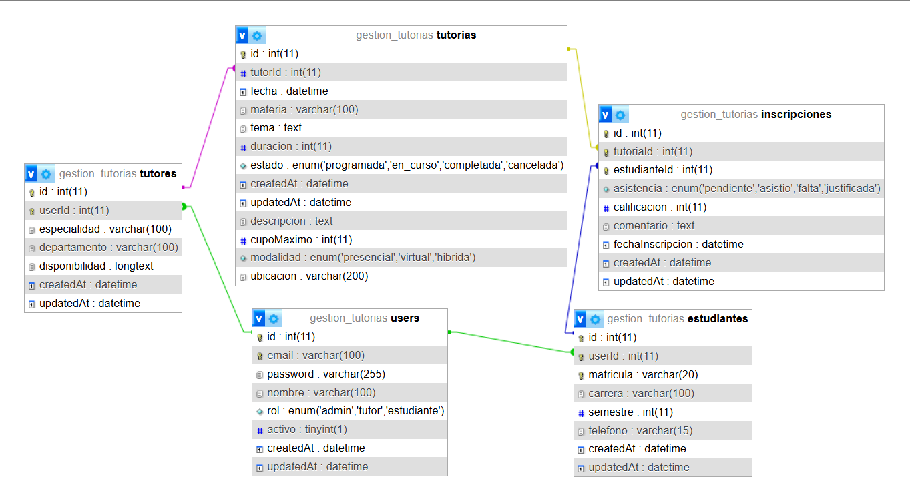
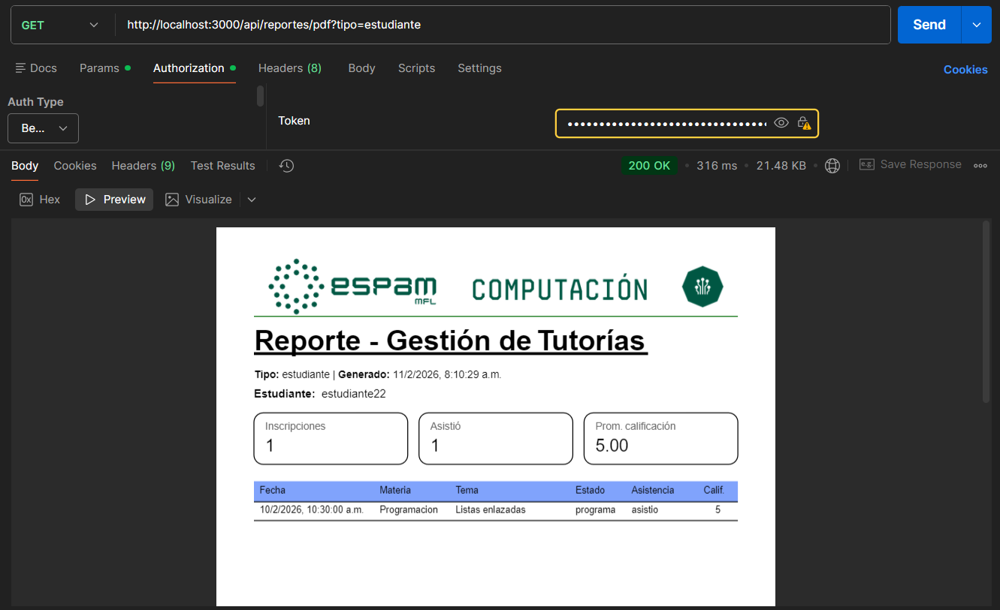
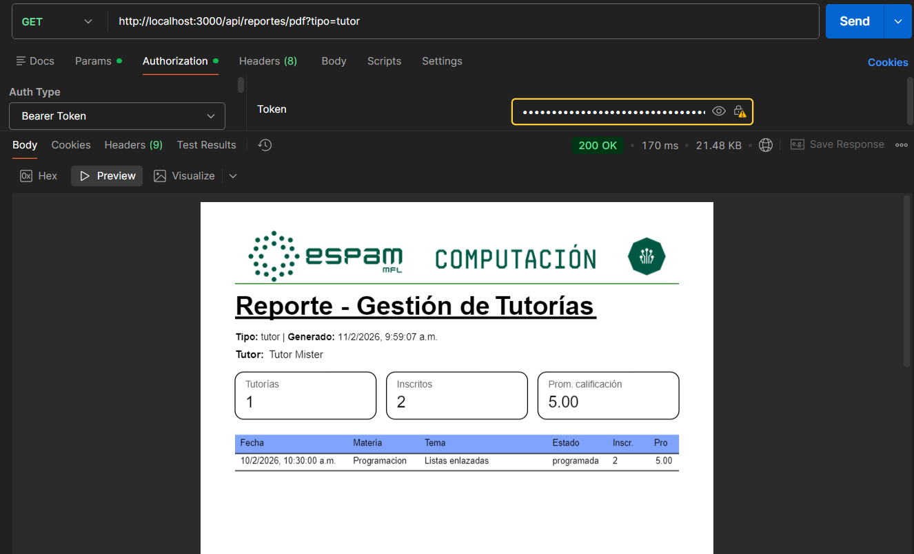
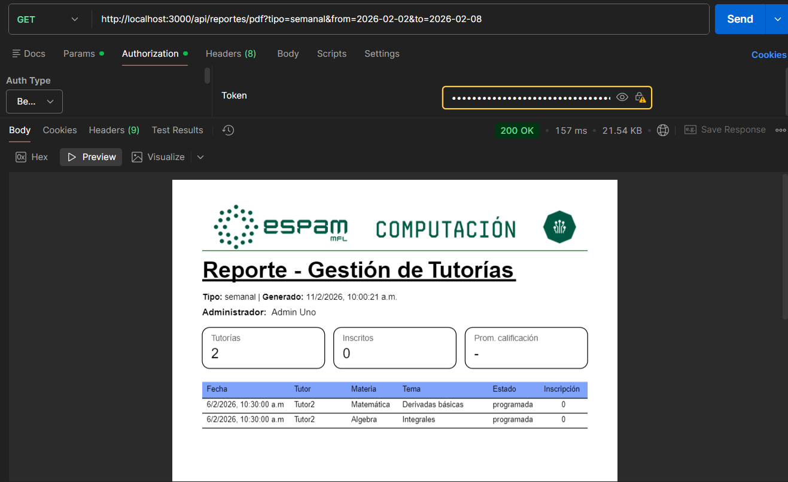

# Gestión de Tutorías

Proyecto para la gestión de tutorías con roles **estudiante, tutor y admin**, generación de reportes en **PDF** y control de inscripciones y asistencia.

---

## 🔹 Tecnologías

- **Backend:** Node.js, Express
- **Base de datos:** MySQL (Sequelize ORM)
- **Autenticación:** JWT
- **Generación de PDF:** PDFKit
- **Testing y desarrollo:** Postman, Nodemon

---

## 🔹 Instalación

1. Clonar el repositorio:
```bash
git clone <https://github.com/GitJeremy12/Gestion_Tutorias_Backend>
cd GESTION_TUTORIAS

2. Instalar dependencias
   npm install o npm i
3. Inicia el servidor en desarrollo
   npm run dev


## Variables de entorno

PORT (Puerto en el que corre la API)
DB_CONNECTION (Tipo de base de Datos a utilizar)
DB_HOST (Dirección del servidor de base de datos)
DB_PORT (Puerto del servidor de base de datos)
DB_DATABASE (Nombre de la Base de Datos)
DB_USERNAME (usuario con Acceso a la base de datos)
DB_PASSWORD (Contraseña del usuario de la base de datos) 
TOKEN_KEY (Clave secreta para firmar tokens JWT)
## Script 
npm run dev inicia el servidor con nodemon
npm start inicia en modo producción

##Estructura del proyecto

GESTION_TUTORIAS/
│
├─ config             #Configuracion del env
├─ controllers/       # Controladores de la API
├─ Db                 #Conexion a la BD
├─ models/            # Modelos Sequelize
├─ routes/            # Rutas de Express
├─ middlewares/       # Middlewares (auth, roles, errores)
├─ services/          # Funciones auxiliares (PDF, email, etc.)
├─ utils/             # Utilidades varias
├─ image/             # Logo u otros assets
├─ index.js           # Punto de entrada del servidor
├─ package.json
└─ README.md

## 🛠 Tecnologías utilizadas

- Node.js

- Express.js

- Sequelize ORM

- MySQL

- JSON Web Tokens (JWT) para autenticación

- PDFKit para generación de reportes

- Nodemailer para envío de correos

- dotenv para variables de entorno

- Nodemon para desarrollo

## 🔹 Endpoints principales

### 👤 Usuarios
- **POST /api/auth/register** – Registrar usuario
- **POST /api/auth/login** – Login y obtener token JWT
- **GET /api/auth/profile** – Obtener perfil del usuario
- **PUT /api/auth/profile** – Actualizar perfil

### 📚 Tutorías
- **GET /api/tutorias** – Listar tutorías (filtros por materia, estado, búsqueda)
- **POST /api/tutorias** – Crear tutoría (solo tutor)
- **PUT /api/tutorias/:id** – Actualizar tutoría
- **DELETE /api/tutorias/:id** – Eliminar tutoría
- **GET /api/tutorias/disponibles** – Listar tutorías disponibles (solo estudiante)

### 📝 Inscripciones
- **POST /api/inscripciones** – Inscribirse en una tutoría (solo estudiante)
- **PUT /api/inscripciones/:id/asistencia** – Registrar asistencia
- **PUT /api/inscripciones/:id/calificacion** – Calificar tutoría
- **DELETE /api/inscripciones/:id** – Cancelar inscripción
- **GET /api/inscripciones/estudiante/:id** – Ver inscripciones de un estudiante
- **GET /api/inscripciones** – Listar todas (solo admin)
- **GET /api/inscripciones/tutoria/:tutoriaId** – Ver inscritos de una tutoría

### 📊 Reportes
- **GET /api/reportes/estudiante/:estudianteId** – Reporte de estudiante
- **GET /api/reportes/tutor/:tutorId** – Reporte de tutor
- **GET /api/reportes/semanal** – Reporte semanal general (solo admin)
- **GET /api/reportes/pdf?tipo=&id=&from=&to=** – Exportar reportes en PDF

## ⚙️ Uso 
- Crear usuarios: tutor, estudiante y admin.
- Registrar tutorías y gestionar inscripciones.
- Generar reportes en JSON o PDF desde los endpoints /reportes.
- Filtrar tutorías por materia, estado y realizar búsquedas por tema o materia.

---

## 🔹 Capturas de los reportes PDF generados
### Reporte Estudiante


### Reporte Tutor


### Reporte Semanal/Admin

